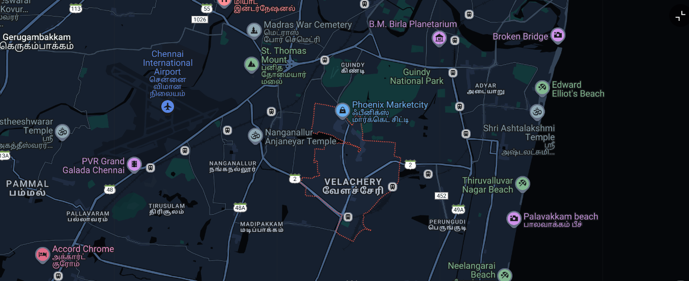

# Ex04 Places Around Me
## Date: 
14/12/24

## AIM
To develop a website to display details about the places around my house.

## DESIGN STEPS

### STEP 1
Create a Django admin interface.

### STEP 2
Download your city map from Google.

### STEP 3
Using ```<map>``` tag name the map.

### STEP 4
Create clickable regions in the image using ```<area>``` tag.

### STEP 5
Write HTML programs for all the regions identified.

### STEP 6
Execute the programs and publish them.

## CODE
```
<!DOCTYPE html>
<html lang="en">
<head>
    <meta charset="UTF-8">
    <title>Chennai Map</title>
</head>
<body>
    <h1>Clickable Map of Valechery</h1>
    <p>Hover over the regions and click to explore more about Valechery.</p>


<!-- Image Map Generated by http://www.image-map.net/ -->


<map name="image-map">
    <area target="" alt="phx" title="phx" href="phx.html" coords="649,190,846,244" shape="rect">
    <area target="" alt="beach" title="beach" href="phx copy.html" coords="887,336,1050,396" shape="0">
    <area target="" alt="pvr" title="pvr" href="phx copy 2.html" coords="108,300,284,350" shape="0">
    <area target="" alt="air" title="air" href="phx copy 3.html" coords="263,75,372,231" shape="0">
    <area target="" alt="war" title="war" href="phx copy 4.html" coords="473,35,692,90" shape="0">
</map>

</body>
</html>

```

```
<!DOCTYPE html>
<html>
<head>
</head>
<body>
    <h1>Phoenix Mall</h1>

    <!-- Display an image -->
    

    <!-- Text below the image -->
    <p> Phoenix Marketcity is all set to transform the shopping & leisure behaviour of Bangaloreans with this world-class shopping centre - One that has never been seen or experienced anywhere in Bangalore before.
        Phoenix Marketcity is spread across 1.4 million sq. ft.</p>

</body>
</html>
```

```
<!DOCTYPE html>
<html>
<head>
</head>
<body>
    <h1>Beach</h1>

    <!-- Display an image -->
    

    <!-- Text below the image -->
    <p>Popular, sandy strand known for its sunsets, plus vendors selling grilled corn & other street food.</p>

</body>
</html>
```
```
<!DOCTYPE html>
<html>
<head>
</head>
<body>
    <h1>PVR Mall</h1>

    <!-- Display an image -->
    

    <!-- Text below the image -->
    <p>Spacious & modern multiplex cinema featuring a spacious food court with international eats.</p>

</body>
</html>
```
```
<!DOCTYPE html>
<html>
<head>
</head>
<body>
    <h1>Chennai Airport</h1>

    <!-- Display an image -->
    

    <!-- Text below the image -->
    <p> Major Indian airport with flights to other domestic hubs and international destinations.</p>

</body>
</html>
```
```
<!DOCTYPE html>
<html>
<head>
</head>
<body>
    <h1>Army War Cemetary</h1>

    <!-- Display an image -->
    

    <!-- Text below the image -->
    <p>Madras War Cemetery is located in Nandambakkam, Chennai (formerly Madras), Tamil Nadu, India. 
        It was created to receive Second World War graves from civil and cantonment cemeteries in the south and east of India where their permanent maintenance could not be assured.</p>

</body>
</html>
```


## OUTPUT


## RESULT
The program for implementing image maps using HTML is executed successfully.
